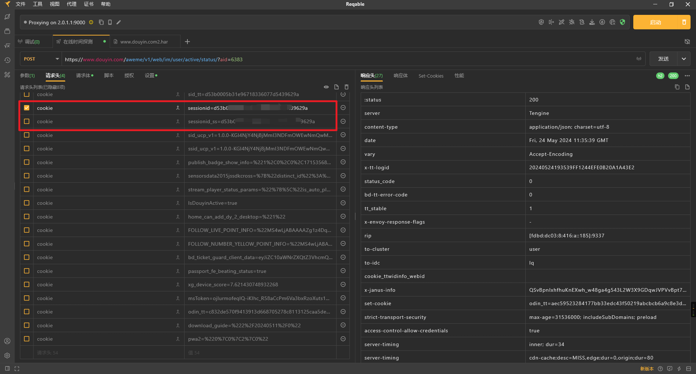
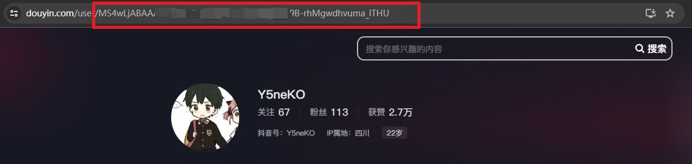
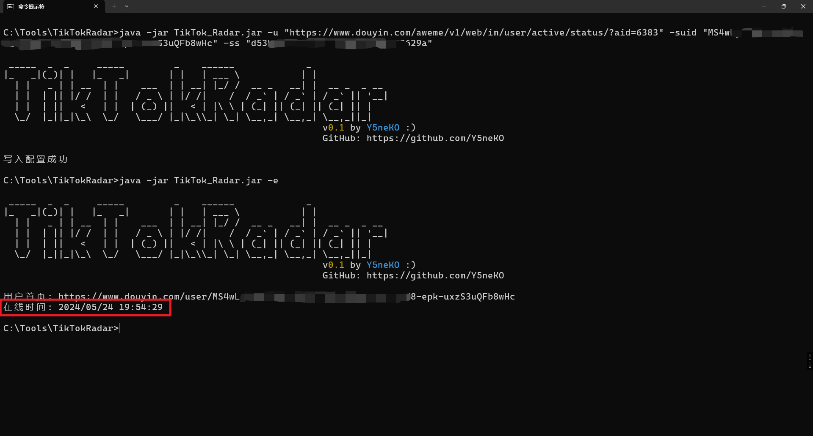

# TikTokRadar

**探测抖音互关好友在线时间小工具（整活）**

<br>

还在为好兄弟背着你刷抖音不回你的上号消息而烦恼吗？快来使用这款工具吧！

众所周知，抖音可以看到互关好友的最近在线时间（开启了在线状态展示），但是我们需要自己上抖音观察，然而如果互为互关好友，对方也会看到自己的登录提示，这样就容易把情况搞得很尴尬，非常不利于兄弟之间的感情（

于是，我发明了这款工具，可以通过抖音开放接口来直接获取互关好友的最近在线时间，无需抖音上号，对方自然看不到自己的登录提示。

“妈妈再也不用担心我的人情世故啦！”

## 使用方法
登录网页版抖音：https://www.douyin.com/

一共需要获取两个参数，第三个参数默认情况下不会变动。

**sessionid**：

通过F12获取Cookie中的sessionid，经过测试这个sessionid可以维持很长一段时间，无需频繁更新。


**需要探测用户的sec user id**

网页版抖音打开目标用户的首页，URI最后一个就是suid


**用户status接口地址**

直接用这个地址就行：
https://www.douyin.com/aweme/v1/web/im/user/active/status/?aid=6383

一般不会有变化，除非抖音后端更新了，到时候会同步更新。

## 参数

```zsh
C:\TikTokRadar>java -jar TikTok_Radar.jar -h

 _____  _  _     _____         _    ______             _
|_   _|(_)| |   |_   _|       | |   | ___ \           | |
  | |   _ | | __  | |    ___  | | __| |_/ /  __ _   __| |  __ _  _ __
  | |  | || |/ /  | |   / _ \ | |/ /|    /  / _` | / _` | / _` || '__|
  | |  | ||   <   | |  | (_) ||   < | |\ \ | (_| || (_| || (_| || |
  \_/  |_||_|\_\  \_/   \___/ |_|\_\\_| \_| \__,_| \__,_| \__,_||_|
                                                          v0.1 by Y5neKO :)
                                                          GitHub: https://github.com/Y5neKO

usage: java TikTokRadar.jar [OPTIONS]
 -e,--exec                    执行查询
 -h,--help                    显示帮助
 -ss,--sessionid-ss <arg>     指定登录用户sessionid
 -suid,--sec_user_ids <arg>   指定要查询的用户
 -u,--base-url <arg>          指定抖音Active_Status_Baseurl(默认情况下无需重新指定)
```

